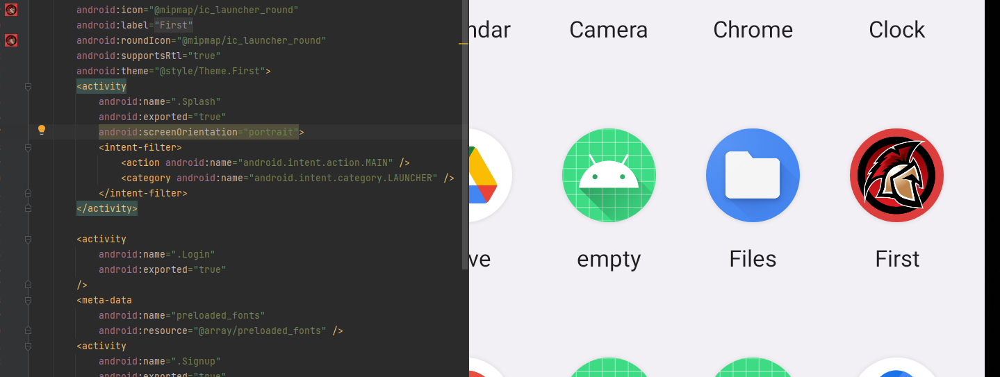
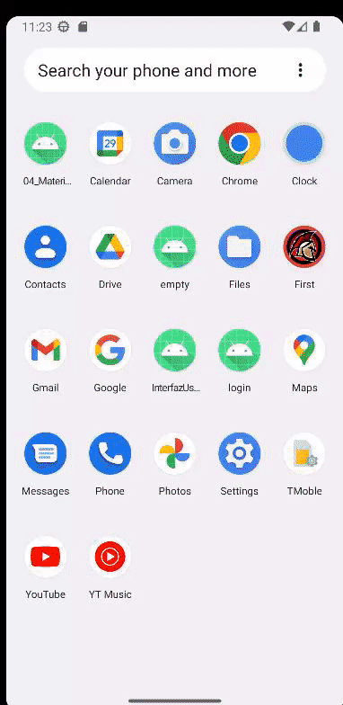
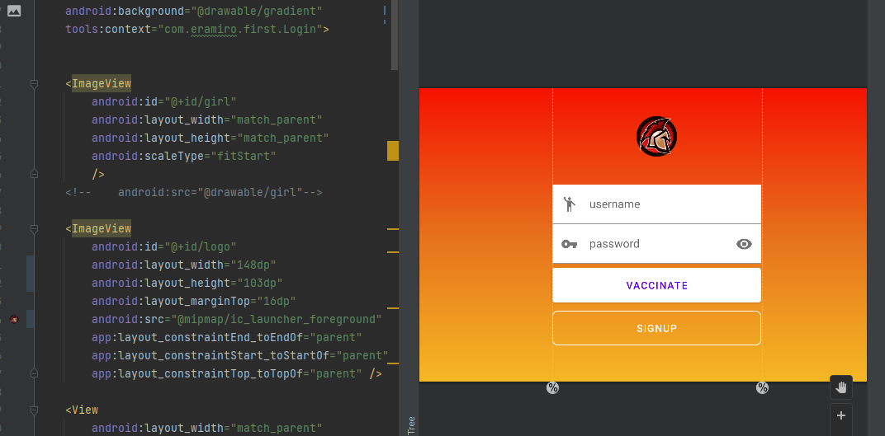
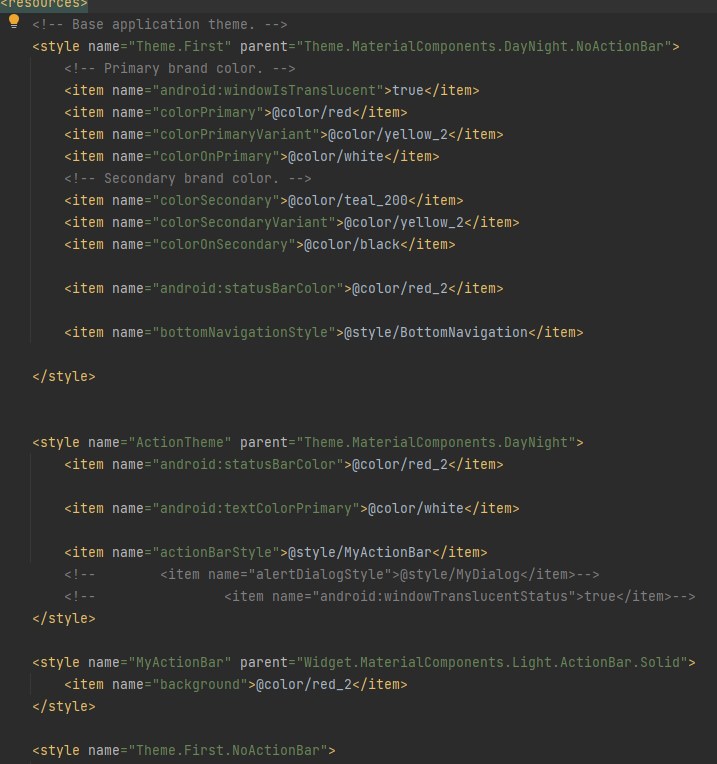
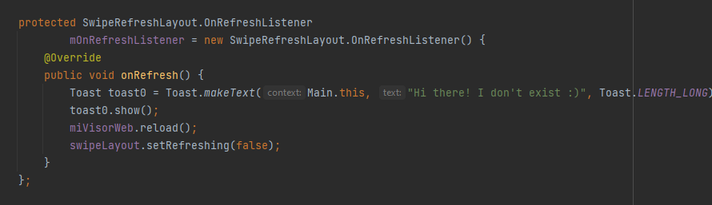
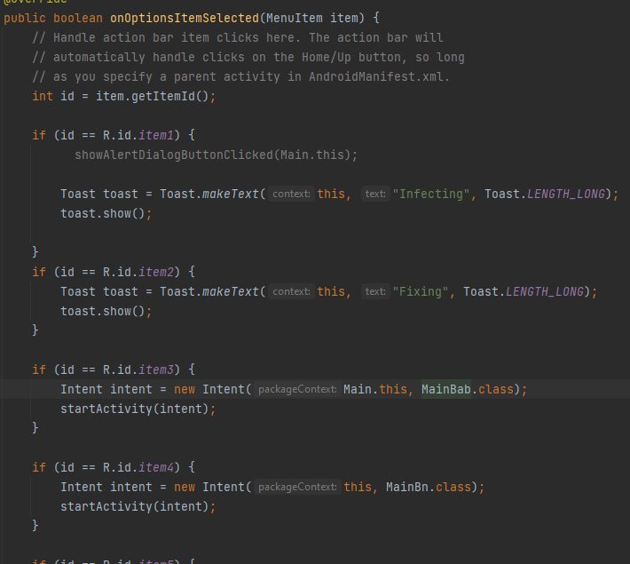
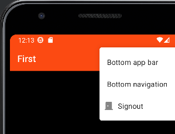

## Mi proyecto guiado de first

definimos el logo en el manifest

Creamos un incio de sesion con una logo con animacion parpadeante y fondo splash que te lleva al login con otra animacion del logo, un gradiante de fondo junto con una imagen...

Creamos land para cuando se gire el dispositivo

Creamos themes 

si refrescamos sale una imagen nueva y un toast. first/Main.java:130

Toolbar, presionas y sale un toast.Menu desplegable de navegacion y salir. https://github.com/KoltX/first/blob/9541c53bc9f737ad0b2a34c1e44fbc492b75915e/app/src/main/java/com/eramiro/first/Main.java

modo noche con colores un poco mas apagados

>This repository is licensed under
>[Creativecommons Org Licenses By Sa 4](http://creativecommons.org/licenses/by-sa/4.0/)
